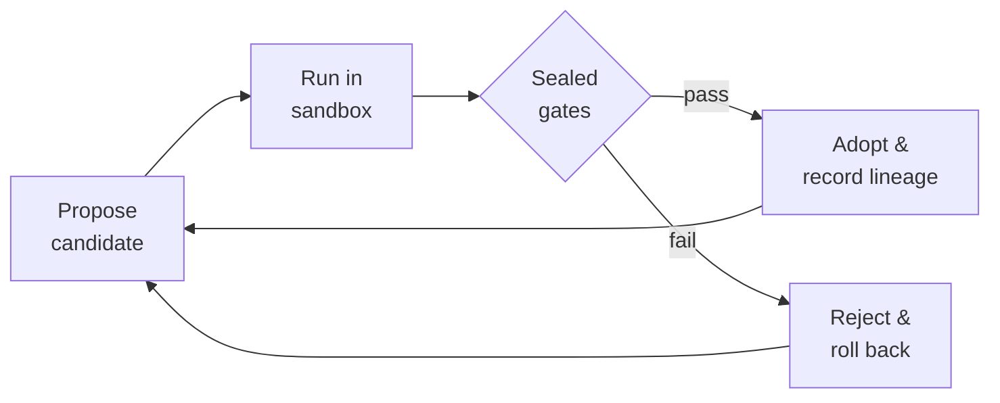

# RSI MetaForge Core

[](https://github.com/sunghunkwag/rsi-metaforge-core/actions/workflows/quick-ci.yml)
[](https://github.com/sunghunkwag/rsi-metaforge-core/actions/workflows/full-evidence.yml)
[](https://deepwiki.com/sunghunkwag/rsi-metaforge-core)

> A research runtime that lets a program **propose, test, and adopt its own improvements** — and only keeps the ones a sealed verifier can't reject.

The question this repository is built to answer is not *"can a system look like it's improving?"* but *"is each improvement actually validated, or just plausible?"* Everything here exists to make that distinction measurable.

---

## 🔁 How it works

Every change — a synthesized program, a new macro, a forged primitive — goes through the same loop. Nothing is kept unless it survives **hidden, sealed gates** the search never sees.



| Guardrail | What it prevents |
| --- | --- |
| **Hidden evaluation** | Answers aren't on disk — the search can't peek. |
| **Frozen baseline** | Every gain is measured against a fixed reference, not itself. |
| **Rollback on failure** | Speculative changes that fail finalization are reverted. |
| **Anti-cheat gates** | Train-only fits and weakened verifiers are rejected, not counted. |

---

## 📊 Results at a glance

A staged research program (Phases 0–I) generalized these gated rules to the top-level searcher and measured the result on a **frozen instrument** fixed *before* the runs. Each arm was reproduced twice, byte-for-byte.

```
Adaptive (live)   ██████████████████████████     26 / 33   ← T15 · T27 · T28 solved together
Frozen baseline   ███████████████████            19 / 33
                  └──────────────────────────┘
                   designer tasks solved on the frozen Phase 0 instrument
```

- **+7 tasks** over the frozen baseline, none lost. Both arms deterministic (two byte-identical runs).
- **Open, and labeled honestly:** T18 · T21 · T22 remain unsolved (missing vocabulary); T29–T32 carry closure certificates (machine-checked unreachability under the base instruction set).
- Predictions were **registered before** the final run and scored after — misses included, in [`SEQUENCING_RESULT.md`](docs/SEQUENCING_RESULT.md).

**Phase J: the certified boundary, crossed.** The closure certificates define where the base ISA ends; Phase J extended it through the same gate discipline and converted two certified-infeasible tasks into gate-adopted, instrument-verified solutions. From the gap analysis ([`ISA_GAP_J.md`](docs/ISA_GAP_J.md)), a two-primitive extension — `BCAST` (constant broadcast, lemma-justified) and `ZGT` (elementwise order test) — was frozen and user-approved in [`ISA_EXTENSION_SPEC.md`](docs/ISA_EXTENSION_SPEC.md); grants stay dormant by default (the incumbent configuration reproduces the committed Phase I artifact byte for byte) and became permanent only through the unchanged A/B + sealed-holdout discipline. Against pre-registered predictions ([`PREDICTIONS_J.md`](docs/PREDICTIONS_J.md)) and instruments frozen before any run, the crossing arm solved **28/33** (digest `1b36ff714b128546`, two byte-identical runs): **T29** fell at wave 1 with the certified-minimal 6-token program, and **T30** fell at wave 2 by composing the granted `ZGT` with an exploration-origin macro mined from the frozen Track 2 archive — a route no designer witness used. T31/T32 remain honest nulls with quantified bands; each crossed task's base-ISA impossibility certificate and its adopted solution are committed side by side. Full record: [`CROSSING_RESULT.md`](docs/CROSSING_RESULT.md).

---

## ⚖️ What this is — and isn't

| ✅ It is | ❌ It is not |
| --- | --- |
| Bounded, validation-gated self-modification | A general-intelligence claim |
| A reference harness for verifier discipline | Proof of unrestricted recursive self-improvement |
| Reproducible, gate-checked, artifact-backed | A drop-in production code-evolution system |

Full claim boundary and public validation record: **[EVIDENCE.md](EVIDENCE.md)**.

---

## 🚀 Quick start

Single-file runtime, standard library only — no install step.

```bash
# See it run
python rsi_levels_metaforge_unified.py --mode demo

# Reproduce the headline comparison
python rsi_levels_metaforge_unified.py --mode transfer-anchor   # adaptive (live)
python rsi_levels_metaforge_unified.py --mode run-frozen        # frozen baseline

# Run the full test suite (156 tests)
python rsi_levels_metaforge_unified.py --mode test
```

<details>
<summary>More modes (evidence batteries, help)</summary>

```bash
python rsi_levels_metaforge_unified.py --mode file-battery      # hidden A/B file tasks
python rsi_levels_metaforge_unified.py --mode forge-battery     # self-forge admission
python rsi_levels_metaforge_unified.py --mode horizon-scan      # closure certificates
python rsi_levels_metaforge_unified.py --mode cfs-battery       # continuous substrate
python rsi_levels_metaforge_unified.py --mode expansion-battery # residue-driven expansion
python rsi_levels_metaforge_unified.py --mode grammar-battery   # depth-1 grammar
python rsi_levels_metaforge_unified.py --mode grammar2-battery  # depth-2 grammar
python rsi_levels_metaforge_unified.py --mode crossing-anchor   # Phase J: live arm + capability-grant channel
python rsi_levels_metaforge_unified.py --help                   # everything else
```

</details>

---

## ✔️ Continuous validation

Two workflows keep the claims honest on every change:

- **Quick CI** — compiles the runtime, checks the CLI, runs anti-cheat guards. Fast, on every push.
- **Full Evidence** — runs every evidence battery plus the full 156-test suite, then uploads the logs and JSON artifacts. Green means the whole record reproduced on a clean machine.

---

## 📚 Learn more

Explore interactively on **[DeepWiki](https://deepwiki.com/sunghunkwag/rsi-metaforge-core)**, or read the reviewer docs:

| Doc | Answers |
| --- | --- |
| [Overview](docs/00_overview.md) | Where do I start? |
| [Architecture](docs/01_architecture.md) | How is it built? |
| [RSI Loop](docs/02_rsi_loop.md) | Where is the self-improvement loop? |
| [Validation Gates](docs/03_validation_gates.md) | How is cheating prevented? |
| [Evidence Logs](docs/04_evidence_logs.md) | What was actually shown? |
| [Limitations](docs/05_limitations.md) | Where does it stop? |

The Phases 0–I record — frozen instruments, registered predictions, per-phase reports, and final evaluations — lives under [`docs/`](docs/), starting from [`SEQUENCING_RESULT.md`](docs/SEQUENCING_RESULT.md). The Phase J record (certified-boundary crossing) starts from [`ISA_GAP_J.md`](docs/ISA_GAP_J.md) and [`ISA_EXTENSION_SPEC.md`](docs/ISA_EXTENSION_SPEC.md), with the frozen evaluation instrument in [`frozen_holdout_extJ.json`](docs/frozen_holdout_extJ.json) and registered predictions in [`PREDICTIONS_J.md`](docs/PREDICTIONS_J.md).

---

<sub>Maintained as a research artifact. Results, terminology, and implementation are experimental, bounded, and subject to revision.</sub>
