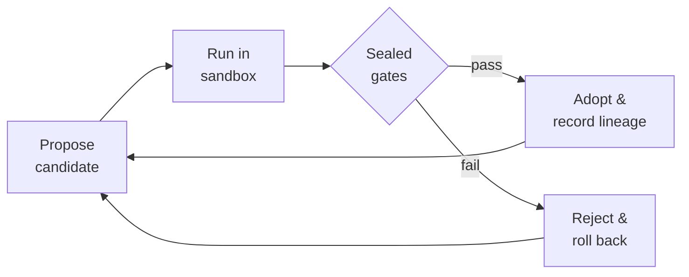

# RSI MetaForge Core

[](https://github.com/sunghunkwag/rsi-metaforge-core/actions/workflows/quick-ci.yml)
[](https://github.com/sunghunkwag/rsi-metaforge-core/actions/workflows/full-evidence.yml)
[](https://deepwiki.com/sunghunkwag/rsi-metaforge-core)

> A research runtime that lets a program **propose, test, and adopt its own improvements** — and only keeps the ones a sealed verifier can't reject.

The question this repository is built to answer is not *"can a system look like it's improving?"* but *"is each improvement actually validated, or just plausible?"* Everything here exists to make that distinction measurable.

---

## How it works

Every change — a synthesized program, a new macro, a forged primitive — goes through the same loop. Nothing is kept unless it survives **hidden, sealed gates** the search never sees.



| Guardrail | What it prevents |
| --- | --- |
| **Hidden evaluation** | Answers aren't on disk — the search can't peek. |
| **Frozen baseline** | Every gain is measured against a fixed reference, not itself. |
| **Rollback on failure** | Speculative changes that fail finalization are reverted. |
| **Anti-cheat gates** | Train-only fits and weakened verifiers are rejected, not counted. |

---

## Results at a glance

A staged research program (Phases 0–J) generalized these gated rules to the top-level searcher — and then to the instruction set itself — measuring every result on **frozen instruments** fixed *before* the runs. Each arm was reproduced twice, byte-for-byte.

```
Extended ISA (Phase J)  ████████████████████████████   28 / 33   ← T29 · T30 crossed their certificates
Adaptive (live)         ██████████████████████████     26 / 33   ← T15 · T27 · T28 solved together
Frozen baseline         ███████████████████            19 / 33
                        └────────────────────────────┘
                         designer tasks solved on the frozen Phase 0 instrument
```

**A separate domain — real file tasks.** The same gated discipline runs on CSV / log / config / repo files, scored by sealed hidden A/B on unseen eval seeds (the hidden expectations never touch the workspace):

```
File-world (csv_normalize · log_aggregate · config_migrate · repo_repair)
Adaptive         ████████████████████████████   1.000   ← mean over the four families
Frozen baseline  ██████                          0.204
```

Per-family breakdown in [EVIDENCE.md](EVIDENCE.md#file-world-evidence-battery).

- **+7 tasks** over the frozen baseline in Phase I, then **+2 certified-infeasible tasks** in Phase J — none lost, every arm deterministic (two byte-identical runs each).
- **Open, and labeled honestly:** T18 · T21 · T22 remain unsolved (missing vocabulary); T31 · T32 remain certified out of reach at the certified horizon even in the extended ISA; T29 · T30 crossed — each base-ISA impossibility certificate is committed beside its adopted solution.
- Predictions were **registered before** the final runs and scored after — misses included, in [`SEQUENCING_RESULT.md`](docs/SEQUENCING_RESULT.md) and [`CROSSING_RESULT.md`](docs/CROSSING_RESULT.md).

**Phase J: the certified boundary, crossed.** The closure certificates define where the base ISA ends; Phase J extended it through the same gate discipline and converted two certified-infeasible tasks into gate-adopted, instrument-verified solutions. From the gap analysis ([`ISA_GAP_J.md`](docs/ISA_GAP_J.md)), a two-primitive extension — `BCAST` (constant broadcast, lemma-justified) and `ZGT` (elementwise order test) — was frozen and user-approved in [`ISA_EXTENSION_SPEC.md`](docs/ISA_EXTENSION_SPEC.md); grants stay dormant by default (the incumbent configuration reproduces the committed Phase I artifact byte for byte) and became permanent only through the unchanged A/B + sealed-holdout discipline. Against pre-registered predictions ([`PREDICTIONS_J.md`](docs/PREDICTIONS_J.md)) and instruments frozen before any run, the crossing arm solved **28/33** (digest `1b36ff714b128546`, two byte-identical runs): **T29** fell at wave 1 with the certified-minimal 6-token program, and **T30** fell at wave 2 by composing the granted `ZGT` with an exploration-origin macro mined from the frozen Track 2 archive — a route no designer witness used. T31/T32 remain honest nulls with quantified bands; each crossed task's base-ISA impossibility certificate and its adopted solution are committed side by side. Full record: [`CROSSING_RESULT.md`](docs/CROSSING_RESULT.md).

---

## Domains

The same gated loop is measured across several substrates — not only the integer benchmark:

- **Stack VM (33 integer tasks):** the core RSI-loop measurement baseline — synthesis, macros, and the extended ISA (`--mode demo`, `--mode test`).
- **General-domain — list / string / grid / record** (Section 11): an oracle-scarce debate pipeline with four strategies — S1 a process scorer (`StepScorer`), S2 committee debate with an adversarial distinguisher, S3 a learned world model (`OpSemanticsModel`), and S4 oracle-free meta-learning config selection with a held-out Goodhart audit (`--mode directive-battery`).
- **File-world — CSV / JSON / log / repo:** real file I/O scored by sealed hidden A/B; skill proposals mined from failure residues and adopted only through a validation gate (`--mode file-battery`).
- **Self-forge → GD bridge:** system-synthesized fold primitives, admitted through sealed gates, are registered as general-domain feature atoms that extend the vocabulary the debate pipeline searches (`--mode forge-battery`).
- **Abstract strategic planning — HDC/VSA + Kuramoto oscillators** (Section 14, *"measured, not mystified"*): an illustrative demo (`--mode hdc-rsi`) that encodes a symbolic action plan into hypervectors, performs analogical transfer via VSA bind/unbind, and selects steps by oscillator phase-locking; the measured interference-field battery is `--mode hdc-battery`.
- **Self-curriculum — a closed task-generation loop** (Phase SC): the system poses its own tasks (each admitted only with a machine-checked feasibility witness, constructed from invertible primitives), solves them against sealed held-outs under an MDL cap, and composes adopted solutions into harder tasks — zero human-authored tasks added. Fourteen anti-gaming invariants each ship with a dedicated in-suite test — twelve construct the attack outright, determinism is proven by two-run digest identity, budgets are literal-pinned and bound into the source pin — and an append-only hash-chained ledger keeps every failure in the denominator (`--mode self-curriculum`, `--mode sc-battery`). Claim boundary: this is a closed-world compounding *measurement*, not an open-ended autonomy claim — transfer to the frozen human instrument is the pre-registered external test ([`SELF_CURRICULUM_SPEC.md`](docs/SELF_CURRICULUM_SPEC.md), [`PREDICTIONS_SC.md`](docs/PREDICTIONS_SC.md), [`SC_RESULT.md`](docs/SC_RESULT.md)). Phase SC2 makes the fence itself an evolution target: the system invents new task *kinds* as pure data over a human-frozen five-form meta-checker algebra, taps hash-pinned external corpus material, and spans capsule products (`--mode schema-forge`, `--mode sc2-battery`) — with schema admission gated by mutation-kill soundness, discrimination, non-collusion, and novelty checks, and headline credit granted only on measured transfer (I15–I23, [`SELF_CURRICULUM_SPEC_V2.md`](docs/SELF_CURRICULUM_SPEC_V2.md), [`PREDICTIONS_SC2.md`](docs/PREDICTIONS_SC2.md), [`SC2_RESULT.md`](docs/SC2_RESULT.md)). Claim boundary, verbatim from the directive: *the check-form algebra is the new fence. This directive moves the boundary one level up and measures whether the move pays; it does not remove the boundary.*

---

## What this is — and isn't

| It is | It is not |
| --- | --- |
| Bounded, validation-gated self-modification | A general-intelligence claim |
| A reference harness for verifier discipline | Proof of unrestricted recursive self-improvement |
| Reproducible, gate-checked, artifact-backed | A drop-in production code-evolution system |
| Multi-domain verifier (list / string / grid / record / file) | A single-domain benchmark |
| Cross-substrate lesson transfer (VM → general-domain) | Domain-specific tuning |

Full claim boundary and public validation record: **[EVIDENCE.md](EVIDENCE.md)**.

---

## Quick start

Single-file runtime, standard library only — no install step.

```bash
# See it run
python rsi_levels_metaforge_unified.py --mode demo

# Reproduce the headline comparison
python rsi_levels_metaforge_unified.py --mode crossing-anchor   # extended ISA (Phase J)
python rsi_levels_metaforge_unified.py --mode transfer-anchor   # adaptive (live)
python rsi_levels_metaforge_unified.py --mode run-frozen        # frozen baseline

# Run the full test suite (194 tests)
python rsi_levels_metaforge_unified.py --mode test
```

<details>
<summary>More modes (evidence batteries, help)</summary>

```bash
python rsi_levels_metaforge_unified.py --mode file-battery      # hidden A/B on real file tasks (csv, log, config, repo)
python rsi_levels_metaforge_unified.py --mode forge-battery     # self-synthesized primitives lifted into the GD pipeline
python rsi_levels_metaforge_unified.py --mode horizon-scan      # closure certificates
python rsi_levels_metaforge_unified.py --mode cfs-battery       # continuous functional substrate search
python rsi_levels_metaforge_unified.py --mode expansion-battery # residue-driven vocabulary expansion
python rsi_levels_metaforge_unified.py --mode grammar-battery   # depth-1 grammar feature search
python rsi_levels_metaforge_unified.py --mode grammar2-battery  # depth-2 grammar feature search
python rsi_levels_metaforge_unified.py --mode self-curriculum   # closed self-curriculum loop (demo)
python rsi_levels_metaforge_unified.py --mode sc-battery        # self-curriculum evidence battery
python rsi_levels_metaforge_unified.py --mode schema-forge      # fence-expansion schema forge (demo)
python rsi_levels_metaforge_unified.py --mode sc2-battery       # fence-expansion evidence battery
python rsi_levels_metaforge_unified.py --mode crossing-anchor   # Phase J: live arm + capability-grant channel
python rsi_levels_metaforge_unified.py --help                   # everything else
```

</details>

---

## Continuous validation

Two workflows keep the claims honest on every change:

- **Quick CI** — compiles the runtime, checks the CLI, runs anti-cheat guards. Fast, on every push.
- **Full Evidence** — runs every evidence battery (including the self-curriculum battery twice, asserting byte-identical digests) plus the full 194-test suite, then uploads the logs and JSON artifacts. Green means the whole record reproduced on a clean machine.

---

## Learn more

Explore interactively on **[DeepWiki](https://deepwiki.com/sunghunkwag/rsi-metaforge-core)**, or read the reviewer docs:

| Doc | Answers |
| --- | --- |
| [Overview](docs/00_overview.md) | Where do I start? |
| [Architecture](docs/01_architecture.md) | How is it built? |
| [RSI Loop](docs/02_rsi_loop.md) | Where is the self-improvement loop? |
| [Validation Gates](docs/03_validation_gates.md) | How is cheating prevented? |
| [Evidence Logs](docs/04_evidence_logs.md) | What was actually shown? |
| [Limitations](docs/05_limitations.md) | Where does it stop? |
| [General-Domain RSI](rsi_levels_metaforge_unified.py) | What domains beyond integer tasks are covered? (Section 11, line ~3384) |

The Phases 0–I record — frozen instruments, registered predictions, per-phase reports, and final evaluations — lives under [`docs/`](docs/), starting from [`SEQUENCING_RESULT.md`](docs/SEQUENCING_RESULT.md). The Phase J record (certified-boundary crossing) runs from the gap analysis ([`ISA_GAP_J.md`](docs/ISA_GAP_J.md)) and the frozen, user-approved extension spec ([`ISA_EXTENSION_SPEC.md`](docs/ISA_EXTENSION_SPEC.md)) through the frozen evaluation instrument ([`frozen_holdout_extJ.json`](docs/frozen_holdout_extJ.json)), the pre-registered predictions ([`PREDICTIONS_J.md`](docs/PREDICTIONS_J.md)), and the final result with its committed artifact ([`CROSSING_RESULT.md`](docs/CROSSING_RESULT.md), [`final_live_phaseJ.json`](docs/final_live_phaseJ.json)).

---

<sub>Maintained as a research artifact. Results, terminology, and implementation are experimental, bounded, and subject to revision.</sub>
