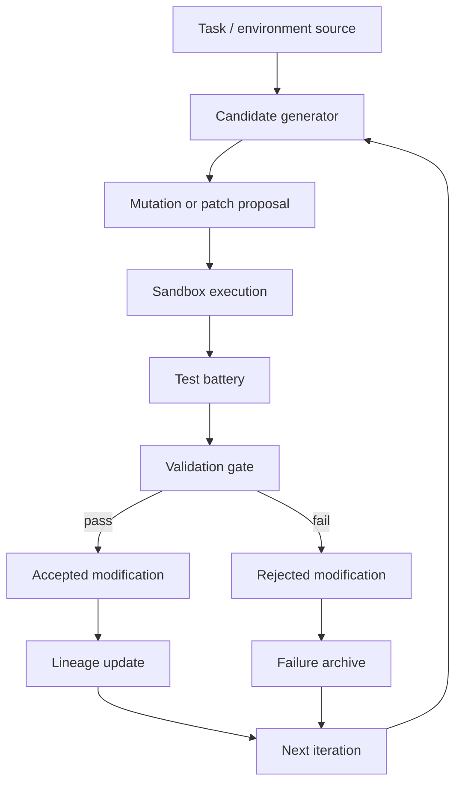

# Architecture

The repository is centered on one monolithic runtime file, [rsi_levels_metaforge_unified (3).py](../rsi_levels_metaforge_unified%20%283%29.py), plus evidence documentation and GitHub Actions workflows. The architecture is best read as a gated experimental harness rather than a generic wrapper around an external model.

## Component Map

| Diagram node | Runtime anchor | What to inspect |
| --- | --- | --- |
| Task / environment source | [`build_sealed_tasks`](../rsi_levels_metaforge_unified%20%283%29.py#L496), [`mint_task`](../rsi_levels_metaforge_unified%20%283%29.py#L576), [`SealedFileTask`](../rsi_levels_metaforge_unified%20%283%29.py#L8344), [`build_general_domain_tasks`](../rsi_levels_metaforge_unified%20%283%29.py#L35391) | Sources of bounded tasks, generated tasks, file-world tasks, and general-domain probes. |
| Candidate generator | [`synthesize`](../rsi_levels_metaforge_unified%20%283%29.py#L1104), [`propose_improvement`](../rsi_levels_metaforge_unified%20%283%29.py#L1377), [`forge_synthesize`](../rsi_levels_metaforge_unified%20%283%29.py#L7541), [`fw_propose_from_residues`](../rsi_levels_metaforge_unified%20%283%29.py#L8927) | Search, macro proposal, self-forge primitive synthesis, and file-world residue-driven proposals. |
| Mutation or patch proposal | [`_mutate`](../rsi_levels_metaforge_unified%20%283%29.py#L815), [`_mutate_drift`](../rsi_levels_metaforge_unified%20%283%29.py#L881), [`ImprovementProposal`](../rsi_levels_metaforge_unified%20%283%29.py#L1308), [`gd_mine_macros`](../rsi_levels_metaforge_unified%20%283%29.py#L35355) | Token mutations, drift mutations, macro bundles, and mined general-domain macros. |
| Sandbox execution | [`compile_program`](../rsi_levels_metaforge_unified%20%283%29.py#L1198), [`file_world_run`](../rsi_levels_metaforge_unified%20%283%29.py#L9107), [`ArtifactFileTask`](../rsi_levels_metaforge_unified%20%283%29.py#L9422) | Candidate execution inside bounded VM/file-task contexts. |
| Test battery | [`run_tests`](../rsi_levels_metaforge_unified%20%283%29.py#L2841), [`file_battery`](../rsi_levels_metaforge_unified%20%283%29.py#L9164), [`forge_battery`](../rsi_levels_metaforge_unified%20%283%29.py#L8050), [`cfs_battery`](../rsi_levels_metaforge_unified%20%283%29.py#L13077), [`grammar_battery`](../rsi_levels_metaforge_unified%20%283%29.py#L13883), [`grammar2_battery`](../rsi_levels_metaforge_unified%20%283%29.py#L14219) | Built-in test suite and evidence battery entrypoints. |
| Validation gate | [`_make_gate`](../rsi_levels_metaforge_unified%20%283%29.py#L396), [`meta_gate`](../rsi_levels_metaforge_unified%20%283%29.py#L1522), [`forge_admit`](../rsi_levels_metaforge_unified%20%283%29.py#L7772), [`gd_validates`](../rsi_levels_metaforge_unified%20%283%29.py#L35309), [`structural_gate`](../rsi_levels_metaforge_unified%20%283%29.py#L6636) | Hidden gates, meta-gates, forge admission, domain validation, and structural anti-bloat checks. |
| Accepted modification | [`run_wave`](../rsi_levels_metaforge_unified%20%283%29.py#L1743), [`_install`](../rsi_levels_metaforge_unified%20%283%29.py#L1504), [`forge_admit`](../rsi_levels_metaforge_unified%20%283%29.py#L7772) | Places where passed candidates are stored or made available to later iterations. |
| Rejected modification | [`MetaGateRecord`](../rsi_levels_metaforge_unified%20%283%29.py#L1412), [`RunState.rejected_digests`](../rsi_levels_metaforge_unified%20%283%29.py#L1709), gate-failure events in [`run_wave`](../rsi_levels_metaforge_unified%20%283%29.py#L1801) | Rejection logs, duplicate-proposal suppression, holdout failures, and counterfactual gate catches. |
| Lineage update | [`RunState`](../rsi_levels_metaforge_unified%20%283%29.py#L1698), [`lineage_report`](../rsi_levels_metaforge_unified%20%283%29.py#L1966), [`runstate_summary`](../rsi_levels_metaforge_unified%20%283%29.py#L2033) | Adopted tokens, waves, searcher versions, macro lineage, events, and serialized run summaries. |

## External Validation Layer

The CI layer is intentionally split:

- [Quick CI](../.github/workflows/quick-ci.yml) compiles the runtime, checks the CLI, runs a dynamic-evaluator guard, and runs the general-domain smoke gate.
- [Full Evidence](../.github/workflows/full-evidence.yml) runs the evidence batteries, the full regression suite, and uploads generated logs and JSON artifacts under `reports/evidence`.

DeepWiki should connect the architecture to those executable checks. A description that ignores gates, accepted/rejected candidates, lineage, or evidence artifacts misses the core research claim.
