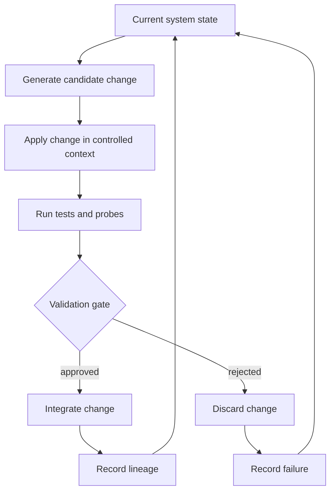

# Recursive Self-Improvement Loop

The main RSI-style loop is implemented by [`run_system`](../rsi_levels_metaforge_unified%20%283%29.py#L1921). Each wave runs task search through [`run_wave`](../rsi_levels_metaforge_unified%20%283%29.py#L1743), updates drift and negative-gram bookkeeping, optionally mints frontier tasks, proposes searcher changes through [`propose_improvement`](../rsi_levels_metaforge_unified%20%283%29.py#L1377), and sends those changes through [`meta_gate`](../rsi_levels_metaforge_unified%20%283%29.py#L1522).

## What Counts as a Candidate Modification

A candidate modification can be one of several bounded objects:

- A synthesized token program for a sealed task, generated by [`synthesize`](../rsi_levels_metaforge_unified%20%283%29.py#L1104).
- A searcher-level macro or weight update represented by [`ImprovementProposal`](../rsi_levels_metaforge_unified%20%283%29.py#L1308).
- A forged primitive proposed by the self-forge battery through [`forge_synthesize`](../rsi_levels_metaforge_unified%20%283%29.py#L7541).
- A file-world skill or repair candidate generated from residues through [`fw_propose_from_residues`](../rsi_levels_metaforge_unified%20%283%29.py#L8927).
- A general-domain macro mined from solved expressions through [`gd_mine_macros`](../rsi_levels_metaforge_unified%20%283%29.py#L35355).

These candidates are not treated as successful because they are syntactically plausible. They must pass the relevant local gates.

## What Counts as Acceptance

For task programs, acceptance means a candidate passes train re-verification plus both sealed gates in [`run_wave`](../rsi_levels_metaforge_unified%20%283%29.py#L1797) and is stored in `RunState.adopted_tokens`.

For searcher modifications, acceptance means [`meta_gate`](../rsi_levels_metaforge_unified%20%283%29.py#L1522) finds at least one newly reachable previously unsolved task whose program passes the external holdout and counterfactual gates. Accepted macros are installed with usage-based credit; unused riders can be dropped before integration.

For batteries such as self-forge, file-world, continuous substrate, expansion, grammar, and grammar2, acceptance is local to the battery's declared verifier. A passed local gate is evidence for that bounded criterion, not a universal claim.

## What Counts as Rejection

Rejection appears in several forms:

- `GATE_FAIL` and `CF_GATE_CATCH` events from [`run_wave`](../rsi_levels_metaforge_unified%20%283%29.py#L1801).
- `META_REJECT` records from [`meta_gate`](../rsi_levels_metaforge_unified%20%283%29.py#L1547).
- Duplicate proposal suppression through `RunState.rejected_digests` in [`run_system`](../rsi_levels_metaforge_unified%20%283%29.py#L1953).
- Battery-specific clean rejection and rollback checks, such as forge revocation, expansion rollback, grammar give-up cases, and structural gate failures.

Rejection is part of the claim boundary. A repository that only records wins would be weaker evidence than one that records both accepted and refused candidates.

## Does Acceptance Prove Real Improvement?

Acceptance means the candidate passed the implemented local criterion. It may support a claim of bounded improvement if the gate is well designed, hidden from the search path, and reproducible. It does not automatically prove broad generalization, open-ended self-improvement, or general intelligence.

The strongest support comes when acceptance is paired with:

- A frozen or fixed-capacity baseline.
- Held-out or sealed evaluation.
- Transfer checks beyond the exact training examples.
- A saved lineage showing repeated accepted improvements.
- Reproducible logs from GitHub Actions or local reruns.

## Logs That Show Loop Behavior

The loop records evidence through:

- `RunState.events`, `gate_records`, `adopted_tokens`, `adopted_wave`, and `adopted_searcher_version`.
- [`lineage_report`](../rsi_levels_metaforge_unified%20%283%29.py#L1966), which summarizes macro lineage and deeper reuse.
- [`runstate_summary`](../rsi_levels_metaforge_unified%20%283%29.py#L2033), which serializes accepted programs, gate records, residues, rejected digests, TCCI reports, and adoption digest.
- CLI modes such as `--mode run-adaptive --save adaptive.json`, `--mode run-frozen --save frozen.json`, and `--mode cf-report`.
- [Full Evidence](../.github/workflows/full-evidence.yml), which captures battery logs and generated JSON artifacts.
