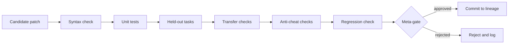

# Validation Gates and Anti-Cheat Controls

The repository's useful claim depends on whether gates prevent fake progress. A candidate that merely fits training examples, weakens a verifier, leaks hidden data, or survives because of measurement error is not strong evidence of self-improvement.



## Implemented Gate Anchors

- Sealed task gates are created by [`_make_gate`](../rsi_levels_metaforge_unified%20%283%29.py#L396) and packaged by [`seal_task`](../rsi_levels_metaforge_unified%20%283%29.py#L411).
- The primary self-modification gate is [`meta_gate`](../rsi_levels_metaforge_unified%20%283%29.py#L1522), which only lands a searcher change when it creates newly gated reachable work.
- [`tcci_pre_score`](../rsi_levels_metaforge_unified%20%283%29.py#L1477) orders macro candidates with compression, transfer, and anti-cheat components, but recovery through holdout and counterfactual gates remains the hard acceptance condition.
- [`run_wave`](../rsi_levels_metaforge_unified%20%283%29.py#L1743) rechecks training outputs, then applies holdout and counterfactual gates before recording task adoption.
- [`forge_admit`](../rsi_levels_metaforge_unified%20%283%29.py#L7772), [`gd_validates`](../rsi_levels_metaforge_unified%20%283%29.py#L35309), and [`structural_gate`](../rsi_levels_metaforge_unified%20%283%29.py#L6636) cover additional local gate types.
- [Quick CI](../.github/workflows/quick-ci.yml) checks compilation, CLI availability, a dynamic-evaluator guard, and the general-domain smoke gate.
- [Full Evidence](../.github/workflows/full-evidence.yml) runs the evidence batteries and full regression suite, then uploads generated logs and JSON artifacts.

## Documentation-Level Criteria

The following are documentation-level criteria for reading the code and evidence. They should be connected to implemented checks whenever possible; they are not a claim that every battery uses exactly this formula.

```math
Score_{new}(T_{heldout}) > Score_{old}(T_{heldout}) + \epsilon
```

```math
Regression = \max(0, Score_{old}(T_{base}) - Score_{new}(T_{base}))
```

```math
\Delta_{transfer} = Score_{new}(T_{transfer}) - Score_{old}(T_{transfer})
```

A strong local acceptance should show positive held-out gain, limited or zero regression on base tasks, and non-negative transfer when transfer is part of the stated gate.

## Anti-Cheat Controls to Inspect

The built-in tests include direct checks for oracle isolation, hidden expectation handling, dynamic evaluator blocking, gate rejection, rollback, and deterministic traces. Useful anchors include:

- [`test_synthesizer_receives_no_oracle`](../rsi_levels_metaforge_unified%20%283%29.py#L2314)
- [`test_no_task_to_solution_lookup`](../rsi_levels_metaforge_unified%20%283%29.py#L2365)
- [`test_no_dynamic_python_evaluator_calls`](../rsi_levels_metaforge_unified%20%283%29.py#L2487)
- [`test_fw_hidden_expectations_never_on_disk`](../rsi_levels_metaforge_unified%20%283%29.py#L9217)
- [`test_fw_agents_never_touch_sealed_scoring`](../rsi_levels_metaforge_unified%20%283%29.py#L9235)
- [`test_speculative_adoption_gate_fenced_and_rolls_back`](../rsi_levels_metaforge_unified%20%283%29.py#L13660)
- [`test_grammar_gate_not_weakened_honest_giveup`](../rsi_levels_metaforge_unified%20%283%29.py#L14015)
- [`test_grammar2_gate_not_weakened_honest_giveup`](../rsi_levels_metaforge_unified%20%283%29.py#L14353)

These tests do not prove that every possible benchmark exploit is impossible. They document the intended failure boundaries and provide reviewer entry points.
