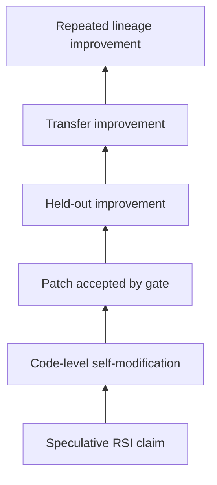

# Evidence Logs

Evidence in this repository should be read as a ladder. Higher rungs require stronger artifacts than lower rungs.



## Current Evidence Level

From checked-in files alone, the repository shows code-level self-modification mechanisms, explicit validation gates, expected battery commands, a historical public evidence summary in [EVIDENCE.md](../EVIDENCE.md), and — since the Phases 0–I research program — committed, SHA-256-pinned run artifacts with per-phase acceptance reports under `docs/`.

Battery-generated logs and result JSON files are still not checked in; those are validated against the newest successful [Full Evidence](https://github.com/sunghunkwag/rsi-metaforge-core/actions/workflows/full-evidence.yml) run for the commit under review, or by reproducing the commands locally.

The historical evidence described in [EVIDENCE.md](../EVIDENCE.md) supports bounded held-out improvement for an earlier runtime. It should not be treated as automatic proof that every later runtime revision has the same evidence level.

## Committed Research-Program Artifacts

The Phases 0–I program committed its measurement instruments and final run artifacts under `docs/`, each pinned by SHA-256 assertions in the built-in test suite:

| Committed file | Role |
| --- | --- |
| [frozen_holdout_phase0.json](frozen_holdout_phase0.json) | Frozen evaluation instrument for all designer-task claims. |
| [probe_battery_phaseD.json](probe_battery_phaseD.json) | Frozen probe battery for exploration descriptors. |
| [exploration_archive_phaseD.json](exploration_archive_phaseD.json), [exploration_archive_phaseG.json](exploration_archive_phaseG.json) | Sealed exploration archives (append-only; prefix-replay verified). |
| [anchor_report_phaseE.json](anchor_report_phaseE.json), [anchor_report_phaseG.json](anchor_report_phaseG.json), [transfer_anchor_phaseE.json](transfer_anchor_phaseE.json) | External anchoring reports (transfer, MDL, properties). |
| [attribution_probe_phaseF.json](attribution_probe_phaseF.json) | Attribution measurements for open tasks. |
| [adaptive_g3only_phaseH.json](adaptive_g3only_phaseH.json) | Single-intervention reconstruction used by the ordering attribution. |
| [final_live_phaseG.json](final_live_phaseG.json), [final_live_phaseI.json](final_live_phaseI.json) | Final live-arm evaluation artifacts (each reproduced twice byte-identically before commit). |

The corresponding evaluation records are [EXPANSION_RESULT.md](EXPANSION_RESULT.md), [ADVANCE_RESULT.md](ADVANCE_RESULT.md), and [SEQUENCING_RESULT.md](SEQUENCING_RESULT.md), with per-phase acceptance outputs in `PHASE*_REPORT.md`.

## Battery Result JSON Files

Battery-generated result JSON files remain generated artifacts. [Full Evidence](../.github/workflows/full-evidence.yml) is configured to collect these generated files if the corresponding batteries create them:

| Generated file | Producer mode | Status |
| --- | --- | --- |
| `file_world_results.json` | `--mode file-battery` | Generated artifact, not checked in. |
| `forge_results.json` | `--mode forge-battery` | Generated artifact, not checked in. |
| `closure_scan.json` | `--mode horizon-scan` | Generated artifact, not checked in. |
| `cfs_results.json` | `--mode cfs-battery` | Generated artifact, not checked in. |
| `expansion_results.json` | `--mode expansion-battery` | Generated artifact, not checked in. |
| `grammar_results.json` | `--mode grammar-battery` | Generated artifact, not checked in. |
| `grammar2_results.json` | `--mode grammar2-battery` | Generated artifact, not checked in. |

Because these battery files are not present in the checkout, inspecting them requires an artifact bundle from a completed evidence run or a local reproduction.

## Battery Outputs

Evidence-oriented runtime modes include:

- [`file_battery`](../rsi_levels_metaforge_unified.py#L9561): file-world hidden A/B evaluations.
- [`forge_battery`](../rsi_levels_metaforge_unified.py#L8447): self-forge primitive admission and downstream reuse.
- `horizon-scan`: closure certificate generation through the final CLI dispatch.
- [`cfs_battery`](../rsi_levels_metaforge_unified.py#L13474): continuous functional substrate tests and propagation checks.
- [`expansion_battery`](../rsi_levels_metaforge_unified.py#L13977): residue-driven extension tests.
- [`grammar_battery`](../rsi_levels_metaforge_unified.py#L14280): depth-1 grammar feature expansion.
- [`grammar2_battery`](../rsi_levels_metaforge_unified.py#L14616): depth-2 grammar feature expansion beyond depth 1.

## Pytest and Built-In Test Outputs

The repository uses a built-in test harness invoked through:

```bash
python "rsi_levels_metaforge_unified.py" --mode test
```

[Full Evidence](../.github/workflows/full-evidence.yml) records this output to `reports/evidence/full_test.log` and checks for:

```text
RESULT: 147 passed, 0 failed
ALL TESTS PASSED
```

That string is an expected workflow condition. Reviewers should confirm it in the actual Actions log or local run output for the commit under review.

## Demo Outputs

The runtime exposes demonstration and comparison commands:

```bash
python "rsi_levels_metaforge_unified.py" --mode demo
python "rsi_levels_metaforge_unified.py" --mode counterfactual
python "rsi_levels_metaforge_unified.py" --mode run-adaptive --save adaptive.json
python "rsi_levels_metaforge_unified.py" --mode run-frozen --save frozen.json
python "rsi_levels_metaforge_unified.py" --mode cf-report --adaptive-json adaptive.json --frozen-json frozen.json
```

Demo output is useful for orientation but is weaker than a clean evidence run with saved artifacts, logs, and commit identity.

## Accepted Modifications

Accepted modifications are reflected in:

- `RunState.adopted_tokens`, `adopted_wave`, and `adopted_searcher_version`.
- `META_ACCEPT` events and `gate_records`.
- [`lineage_report`](../rsi_levels_metaforge_unified.py#L2301).
- [`runstate_summary`](../rsi_levels_metaforge_unified.py#L2397).
- Battery-specific result JSON files when generated.

## Rejected Modifications

Rejected or blocked modifications are reflected in:

- `GATE_FAIL`, `CF_GATE_CATCH`, `META_REJECT`, `NO_PROPOSAL`, and `SKIP_DUPLICATE_PROPOSAL` events.
- `RunState.rejected_digests`.
- Battery-specific rollback, give-up, and clean-rejection tests.
- Full-suite tests that assert gates reject sabotage, train-only fits, undeclared oracle access, and unsupported targets.

## Failure Cases

Known failure or weakness categories include:

- Historical evidence for an older runtime does not automatically validate the current runtime.
- Local pass criteria can be narrower than broad generalization.
- Missing generated result artifacts make independent inspection harder until Actions artifacts or local runs are collected.
- Battery results depend on the declared task and gate design.
- A gate can be incomplete even if all current tests pass.

## Ambiguous Cases

Ambiguous evidence includes candidates that pass train checks but fail sealed gates, speculative candidates that roll back, grammar expansions that only work inside declared feature closure, and historical results whose exact runtime does not match the current file.

Reviewers should prefer artifacts with commit identity, workflow logs, generated JSON, and clear accepted/rejected lineage over narrative summaries alone.
