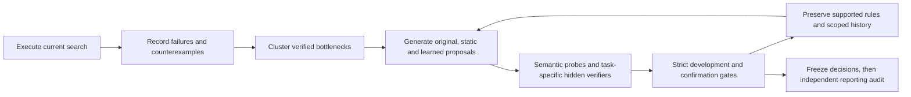

# Research on the improvement procedure

The first RSI-2 experiment is a measured null result. This separate engine tests
why its improver stalled and whether changing its improvement procedure helps.
Read `PROTOCOL.md` for the registered comparison and its limits.



The mechanism is explicit: a persistent typed proposal stream avoids repeatedly
starting at known failures; semantic probes expose runtime-invalid and
candidate-independent scores; a NumPy ranker learns a proposal-productivity
proxy from previous-cycle outcomes. Equal resource ceilings, separate cost
accounting, state-scoped measurement memory, and strict task gates prevent a
unit-test pass or a faster tie from masquerading as task capability.

Object-level task heuristics, loop-level verification/frontier changes, and
meta-loop learned proposal rankings are reported separately. A proxy gain is
not recursive self-improvement. A model that fails its comparison is kept only
as diagnostic evidence, not as an accepted improvement policy.

From the repository root, using the existing NumPy environment:

```sh
export OPENBLAS_NUM_THREADS=1 OMP_NUM_THREADS=1
/workspace/.venvs/rsi2/bin/python -m unittest discover -s rsi2/tests -v
/workspace/.venvs/rsi2/bin/python -m rsi2.research.run \
  --workers 3 --output /workspace/scratch/rsi2/research-reproduction
/workspace/.venvs/rsi2/bin/python -m rsi2.research.report \
  --results /workspace/scratch/rsi2/research-reproduction \
  --output /workspace/scratch/rsi2/research-reproduction.md \
  --rules /workspace/scratch/rsi2/research-reproduction-rules.json
```

Use a new output directory. Every seed checkpoints each cycle's raw candidates,
failure clusters, probes, screens, confirmations, fitted model and proposal
memory. The runner writes the policy freeze before opening the separate audit
capability. A partial study cannot supply a complete positive comparison.

The first procedure run completed 11/27 cycles and the evaluation-reuse run
completed 22/27 before their selection guards stopped them. Both retained the
incumbent and left the reporting audit unopened. The corresponding 11 cycles
had identical scientific results; actual inner task evaluations decreased from
19,640 to 10,588 (46.1%) and their CPU decreased from 4,671.97 to 2,248.67 seconds
(51.9%). Savings exclude unmatched cycles. Total run CPU differs with coverage.
Read `EFFICIENCY_RESULTS.md` for scope and `EFFICIENCY_RULES.json` for the
limited retained rule. Task and learned-procedure gain remain unestablished.

`EFFICIENCY_PROTOCOL.md` registers that intervention before its execution.
Use a new directory for `python -m rsi2.research.efficient_run --workers 3
--output PATH`; the same report command accepts its output. Compare against the
retained baseline using:

```sh
/workspace/.venvs/rsi2/bin/python -m rsi2.research.efficiency_report \
  --baseline rsi2/research/results --results PATH \
  --verification rsi2/research/EFFICIENCY_VERIFIERS.json \
  --output comparison.md --rules comparison-rules.json
```

`SELF_REFINEMENT_PROTOCOL.md` separately registers the bounded autonomous
coordinator. It derives a procedure hypothesis from recorded failures, executes
paired task-specific verifiers, preserves admitted rules, and automatically
uses the selected memory factory in the next cycle. Run it with
`python -m rsi2.research.self_refinement_run --output NEW_PATH`. It changes the
evaluation method; arbitrary algorithm synthesis and task-solving RSI require
separate evidence. All cycle reports contain the eleven requested fields.

No original study output is overwritten. No runtime network, pretrained model,
LLM, API, service or hand-written heuristic is used.

The autonomous two-cycle trace completed in 110.61 aggregate CPU seconds.
The runtime admitted and applied its own logical-work rule: actual task
evaluations fell 26.7% on VALIDATION and 20.8% on confirmation, with identical
scientific results on all three seeds. Confirmation CPU increased about 13%,
so the retained rule does not establish general physical speed or task-solving
RSI. Read `SELF_REFINEMENT_RESULTS.md` for every cycle's eleven evidence fields,
raw measurements and limitations, and `SELF_REFINEMENT_RULES.json` for the rule.


## Ongoing recursive-engine development

The original study remains a measured null. New TRAIN-only methods and all
failed cycles are preserved separately; none currently establishes RSI.
`BOOTSTRAP_RESULTS.md` reports the distinct search diagnostics.
`RECURSIVE_BOOTSTRAP_RESULTS.md` reports the frozen recursive pilot: only
generation0 completed, generation1 wake remained5/36, and B16 screens never
reached scorer-guided descendants. Its truthful partial artifact is
`recursive_bootstrap_results/FULL_seed11.json.gz`.

Read `SCREEN_CAUSALITY_REVISION_PROTOCOL.md`,
`DERIVATION_NEIGHBORHOOD_PROTOCOL.md`, and the unrun
`FAILURE_CREDIT_PROTOCOL.md` before further development. Revised B16 screening
reaches33 descendants per scorer, but every screen still solves1/4 and its
confirmation order remains unchanged. See `screen_revision_results/` for the
independent replay and eleven-field cycle report. Lossless journal persistence
is a measured storage correction; first-write/reconstruction overhead remains.

A portable independent replay of the frozen partial pilot is:

```sh
python -m rsi2.research.recursive_pilot_audit \
  --artifact rsi2/research/recursive_bootstrap_results/FULL_seed11.json.gz \
  --summary rsi2/research/recursive_bootstrap_results/summary.json \
  --output /tmp/recursive-pilot-independent-audit.json
```

The registered matched candidate-generator diagnostic uses a new empty output
directory and one600 aggregate CPU-second watchdog:

```sh
python -m rsi2.research.coordinate_diagnostic_run \
  --source rsi2/research/recursive_bootstrap_results/FULL_seed11.json.gz \
  --output /workspace/scratch/rsi2/coordinate-reproduction
```

It compares cold/prior-bank population and typed derivation neighborhoods at
B64, then the registered B640 follow-up. Each selected program is independently
checked on all public AND hidden TRAIN examples. Every search receives the same
fresh frozen grammar, zero scorer and root allocation. Recorded compiler work
units differ across algorithms; equal candidate budgets do not imply equal
physical work. No evaluation partitions are opened. Unrun/partial cases cannot
support admission, an eight-generation claim, generalization or original a-e.
`*.checkpoint.json` files are storage manifests; inspect their complete evidence
using `rsi2.research.journal_checkpoint.reconstruct(path).record`.

That diagnostic has now completed all six conditions in 487.17 aggregate CPU
seconds. Independent replay checked all 16,067 candidates and 12,951 descendant
edges. Both methods solve the same five TRAIN tasks at B64. At cold B640,
population solves six and coordinates five, so the coordinate change fails its
admission gate. See `COORDINATE_DIAGNOSTIC_RESULTS.md` and
`coordinate_diagnostic_results/independent/` for the complete negative result
and portable replay. Completion and valid evidence do not imply improvement.

New methods preserve the frozen DSL, evaluator, original data/results,
`rsi_levels_metaforge_unified.py` and existing `docs/`. Human-engineered kernels,
causal wiring corrections and smaller ASTs remain distinct from engine-learned,
verifier-admitted cumulative improvements. Keep iterating from measured TRAIN
failures without using final evaluation outcomes to choose revisions.
