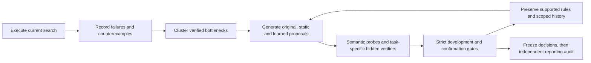

# Research on the improvement procedure

The first RSI-2 experiment is a measured null result. This separate engine tests
why its improver stalled and whether changing its improvement procedure helps.
Read `PROTOCOL.md` for the registered comparison and its limits.



The mechanism is explicit: a persistent typed proposal stream avoids repeatedly
starting at known failures; semantic probes expose runtime-invalid and
candidate-independent scores; a NumPy ranker learns a proposal-productivity
proxy from previous-cycle outcomes. Equal resource ceilings, separate cost
accounting, state-scoped measurement memory, and strict task gates prevent a
unit-test pass or a faster tie from masquerading as task capability.

Object-level task heuristics, loop-level verification/frontier changes, and
meta-loop learned proposal rankings are reported separately. A proxy gain is
not recursive self-improvement. A model that fails its comparison is kept only
as diagnostic evidence, not as an accepted improvement policy.

From the repository root, using the existing NumPy environment:

```sh
export OPENBLAS_NUM_THREADS=1 OMP_NUM_THREADS=1
/workspace/.venvs/rsi2/bin/python -m unittest discover -s rsi2/tests -v
/workspace/.venvs/rsi2/bin/python -m rsi2.research.run \
  --workers 3 --output /workspace/scratch/rsi2/research-reproduction
/workspace/.venvs/rsi2/bin/python -m rsi2.research.report \
  --results /workspace/scratch/rsi2/research-reproduction \
  --output /workspace/scratch/rsi2/research-reproduction.md \
  --rules /workspace/scratch/rsi2/research-reproduction-rules.json
```

Use a new output directory. Every seed checkpoints each cycle's raw candidates,
failure clusters, probes, screens, confirmations, fitted model and proposal
memory. The runner writes the policy freeze before opening the separate audit
capability. A partial study cannot supply a complete positive comparison.

No original study output is overwritten. No runtime network, pretrained model,
LLM, API, service or hand-written heuristic is used.
