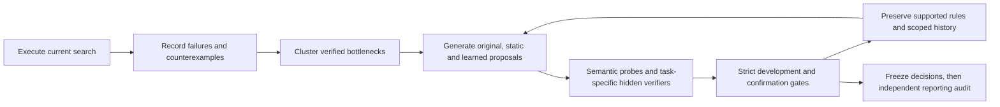

# Research on the improvement procedure

The first RSI-2 experiment is a measured null result. This separate engine tests
why its improver stalled and whether changing its improvement procedure helps.
Read `PROTOCOL.md` for the registered comparison and its limits.



The mechanism is explicit: a persistent typed proposal stream avoids repeatedly
starting at known failures; semantic probes expose runtime-invalid and
candidate-independent scores; a NumPy ranker learns a proposal-productivity
proxy from previous-cycle outcomes. Equal resource ceilings, separate cost
accounting, state-scoped measurement memory, and strict task gates prevent a
unit-test pass or a faster tie from masquerading as task capability.

Object-level task heuristics, loop-level verification/frontier changes, and
meta-loop learned proposal rankings are reported separately. A proxy gain is
not recursive self-improvement. A model that fails its comparison is kept only
as diagnostic evidence, not as an accepted improvement policy.

From the repository root, using the existing NumPy environment:

```sh
export OPENBLAS_NUM_THREADS=1 OMP_NUM_THREADS=1
/workspace/.venvs/rsi2/bin/python -m unittest discover -s rsi2/tests -v
/workspace/.venvs/rsi2/bin/python -m rsi2.research.run \
  --workers 3 --output /workspace/scratch/rsi2/research-reproduction
/workspace/.venvs/rsi2/bin/python -m rsi2.research.report \
  --results /workspace/scratch/rsi2/research-reproduction \
  --output /workspace/scratch/rsi2/research-reproduction.md \
  --rules /workspace/scratch/rsi2/research-reproduction-rules.json
```

Use a new output directory. Every seed checkpoints each cycle's raw candidates,
failure clusters, probes, screens, confirmations, fitted model and proposal
memory. The runner writes the policy freeze before opening the separate audit
capability. A partial study cannot supply a complete positive comparison.

The first procedure run completed 11/27 cycles and the evaluation-reuse run
completed 22/27 before their selection guards stopped them. Both retained the
incumbent and left the reporting audit unopened. The corresponding 11 cycles
had identical scientific results; actual inner task evaluations decreased from
19,640 to 10,588 (46.1%) and their CPU decreased from 4,671.97 to 2,248.67 seconds
(51.9%). Savings exclude unmatched cycles. Total run CPU differs with coverage.
Read `EFFICIENCY_RESULTS.md` for scope and `EFFICIENCY_RULES.json` for the
limited retained rule. Task and learned-procedure gain remain unestablished.

`EFFICIENCY_PROTOCOL.md` registers that intervention before its execution.
Use a new directory for `python -m rsi2.research.efficient_run --workers 3
--output PATH`; the same report command accepts its output. Compare against the
retained baseline using:

```sh
/workspace/.venvs/rsi2/bin/python -m rsi2.research.efficiency_report \
  --baseline rsi2/research/results --results PATH \
  --verification rsi2/research/EFFICIENCY_VERIFIERS.json \
  --output comparison.md --rules comparison-rules.json
```

`SELF_REFINEMENT_PROTOCOL.md` separately registers the bounded autonomous
coordinator. It derives a procedure hypothesis from recorded failures, executes
paired task-specific verifiers, preserves admitted rules, and automatically
uses the selected memory factory in the next cycle. Run it with
`python -m rsi2.research.self_refinement_run --output NEW_PATH`. It changes the
evaluation method; arbitrary algorithm synthesis and task-solving RSI require
separate evidence. All cycle reports contain the eleven requested fields.

No original study output is overwritten. No runtime network, pretrained model,
LLM, API, service or hand-written heuristic is used.

The autonomous two-cycle trace completed in 110.61 aggregate CPU seconds.
The runtime admitted and applied its own logical-work rule: actual task
evaluations fell 26.7% on VALIDATION and 20.8% on confirmation, with identical
scientific results on all three seeds. Confirmation CPU increased about 13%,
so the retained rule does not establish general physical speed or task-solving
RSI. Read `SELF_REFINEMENT_RESULTS.md` for every cycle's eleven evidence fields,
raw measurements and limitations, and `SELF_REFINEMENT_RULES.json` for the rule.
